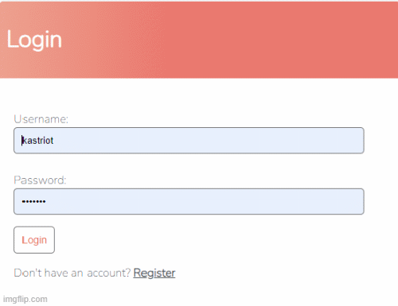

# To Do App

Hello there, this is a To Do App.

### Table of Contents

- [Technologies](#Technologies)
- [Knowledge](#Knowledge)
- [Features](#Features)

#### Technologies

- Python
- Django 

### Knowledge
  - I have learned to build a functional Login/Signup 
  - Understood the major logic of MVT 
  - Gained basic knowledge on Models , Views ,Templates and URLs
  
 

### Features
  - Register User
  - Login/Logout User
  - CRUD 
 
